# Big Data Pipeline on AWS — Basic-Fit Member Analysis

End-to-end batch pipeline on AWS to analyze gym member behavior using real-world data.

> This is an academic project and is not officially affiliated with Basic-Fit.

## AWS Services Used

- **Amazon S3** — Zone-based storage: raw, processed, dq-results, analytics
- **AWS Glue Crawler** — Automatic dataset cataloging
- **AWS Glue Data Catalog** — Table schema registry
- **AWS Glue Data Quality** — Validation with 8 DQDL rules (score 75%)
- **AWS Glue Studio** — Visual ETL Job with transformations
- **AWS Glue Spark** — Analytical processing and KPI calculation
- **Amazon Athena** — SQL queries directly on S3
- **Power BI Desktop** — Final dashboard with KPIs and insights

## Dataset

Gym Membership Dataset from Kaggle (author: Tarek Adam, license CC0).
1,000 records · 18 columns · CSV format.

[View on Kaggle](https://www.kaggle.com/datasets/ka66ledata/gym-membership-dataset)

## Architecture

S3 raw → Glue Crawler → Glue Data Quality → Glue ETL Job → S3 processed → Spark Job → S3 analytics → Athena → Power BI

## Screenshots

| # | Description |
|---|---|
| 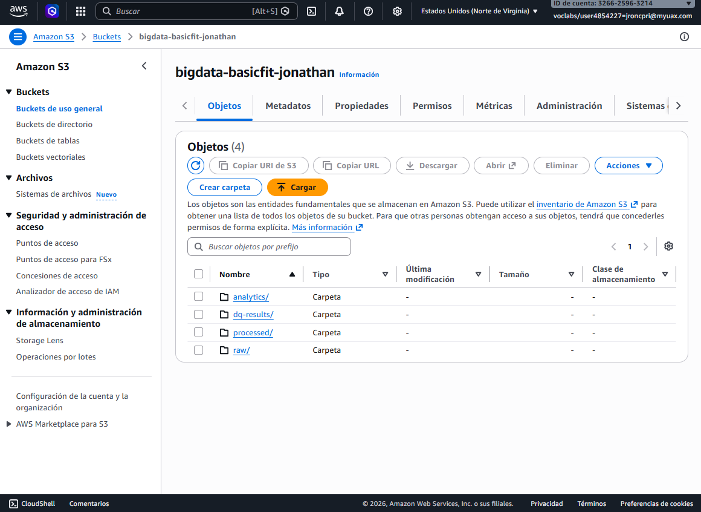 | S3 Bucket Zones |
| 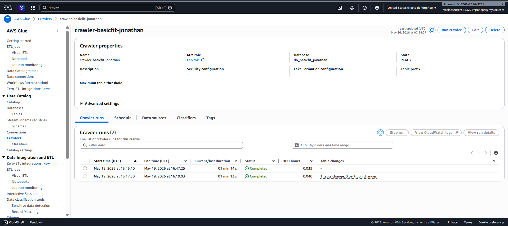 | Glue Crawler |
| 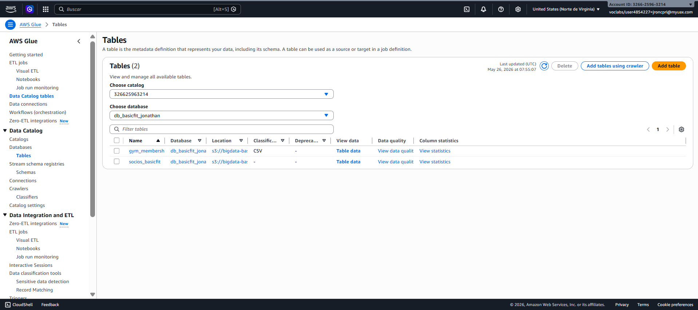 | Glue Data Catalog Tables |
| 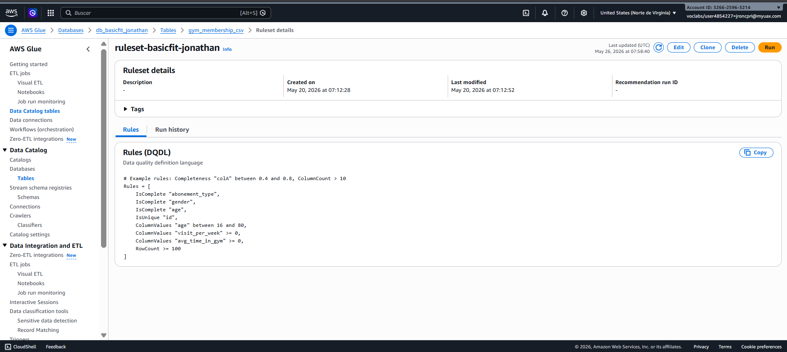 | Glue DQ Ruleset |
| 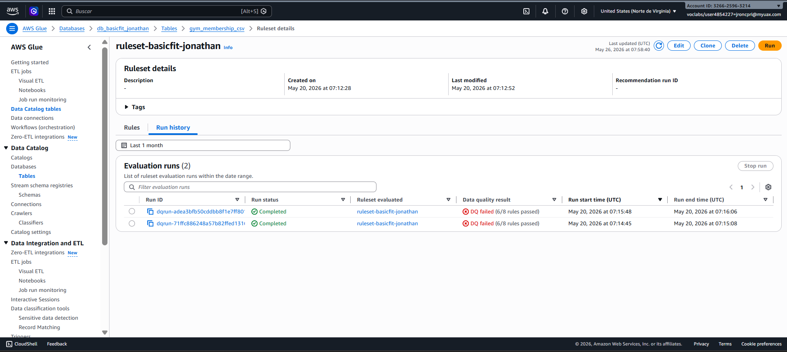 | Glue DQ Run History |
| 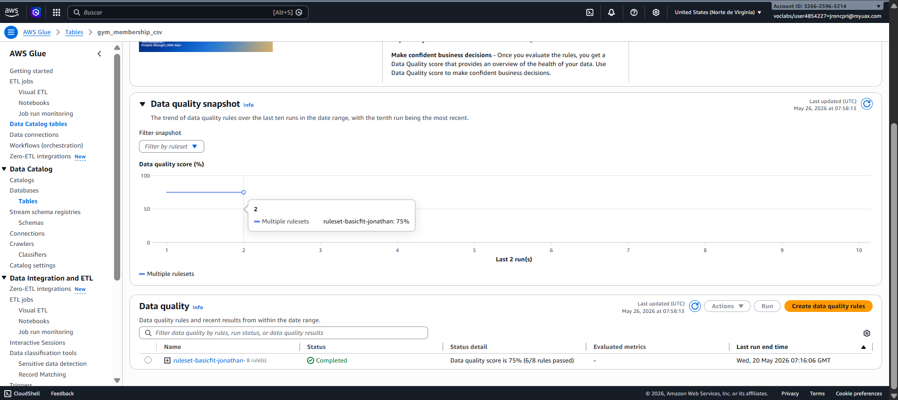 | Glue DQ Score Snapshot |
| 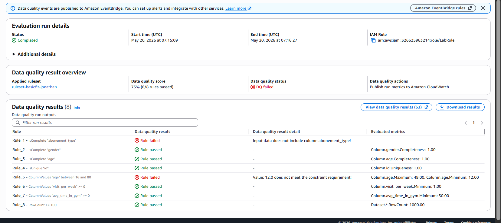 | Glue Data Quality — Results |
| 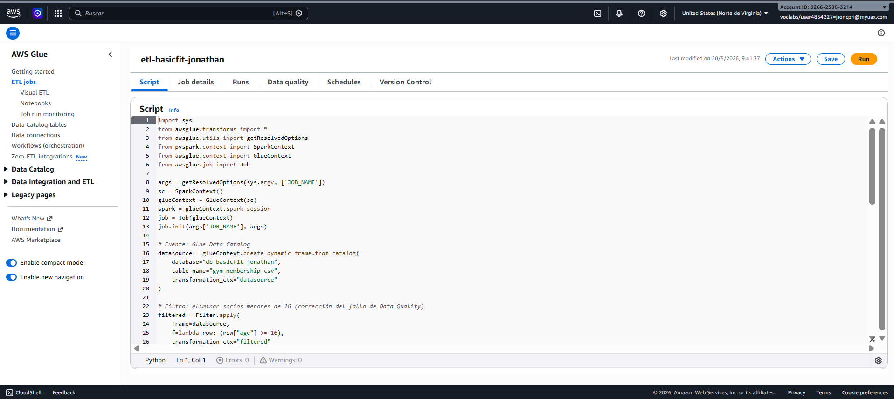 | Glue ETL Job Script |
| 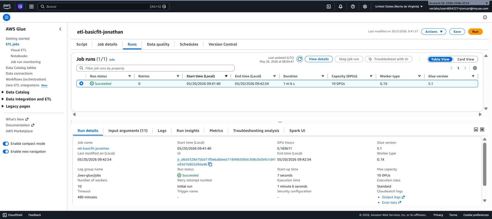 | Glue ETL Job — Run Succeeded |
| 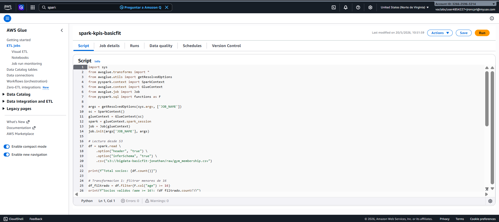 | Glue Spark KPIs Script |
| 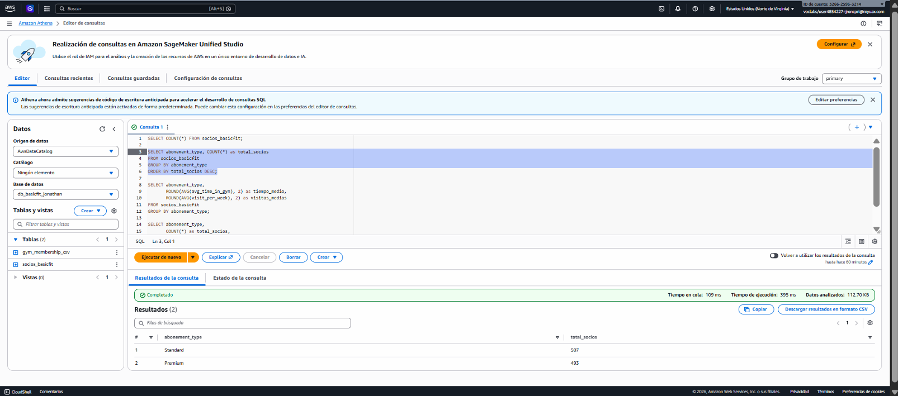 | Athena — Members by Type |
| 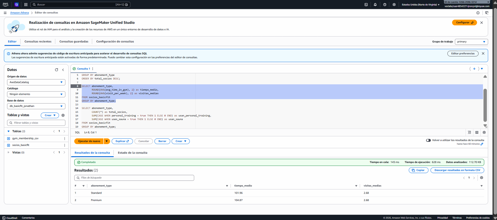 | Athena — Avg Time & Visits |
| 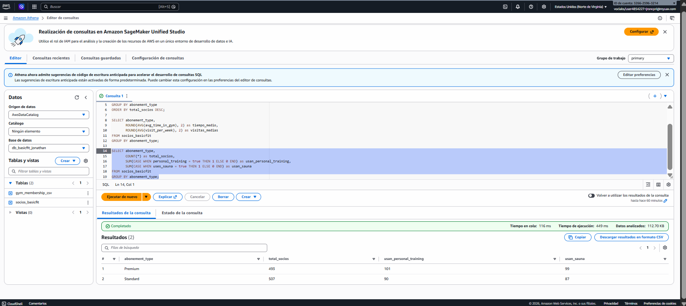 | Athena — Services Usage |
| 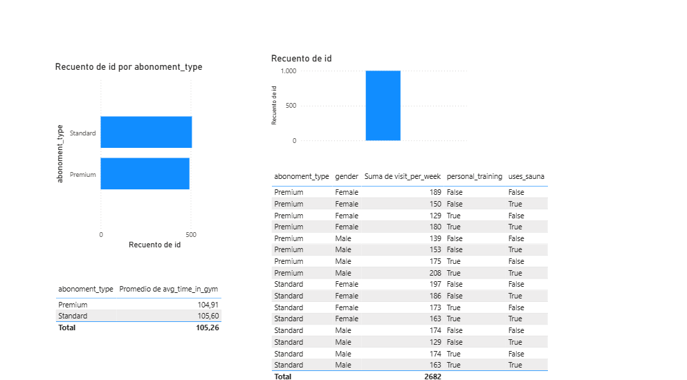 | Power BI Dashboard |

## Repository Structure

- `etl_job.py` — Glue Studio ETL Job script
- `spark_kpis.py` — Spark job script (v2.0), dynamically parameterized with Parquet output
- `ruleset_dqdl.txt` — AWS Glue Data Quality ruleset
- `athena_queries.sql` — SQL queries executed in Athena
- `screenshots/` — Evidence captures for each pipeline phase

## Technical Optimizations

**Dynamic Parameterization:** The `spark_kpis.py` script was refactored using `getResolvedOptions` to receive the `--BUCKET_NAME` argument at runtime. This eliminates hardcoded paths, making the pipeline secure, reusable and production-ready across any AWS environment.

**Storage Format Evolution:** The final output of the Spark Job was upgraded to columnar **Apache Parquet** format. Although the initial deployment and Athena queries shown in the `screenshots/` folder were executed using CSV, this improvement is implemented to significantly optimize query performance and reduce S3 read costs in subsequent execution cycles.
